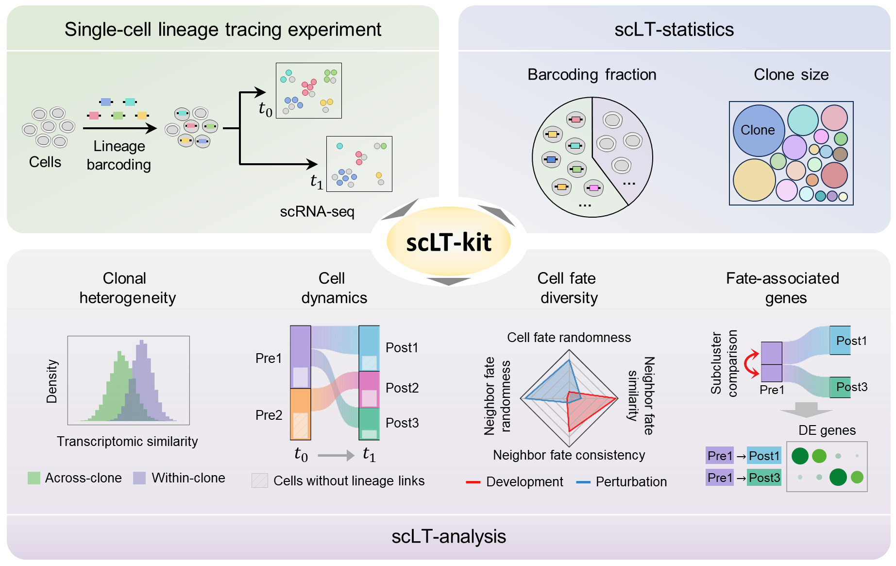

# scLT-kit

[](https://pypi.org/project/scLTkit/)

## Introduction
`scLT-kit` is a toolkit for analyzing single-cell lineage-tracing (LT-scSeq) data.

<div align=center>

</div>

## System Requirements
- Python version: >= 3.7

## Dependencies
- numpy, pandas, sklearn, scipy, matplotlib, seaborn

## Installation

The release version of `scLT-kit`+ python package can be installed directly via pip:
```
pip install scLTkit
```

## Quick Start of scLT-kit

Refer to folder: [tutorial](https://github.com/czythu/scLTkit/tree/main/tutorial) for full pipeline.

Example data1: [Larry-Invitro-differentiation](https://cloud.tsinghua.edu.cn/f/1b94b3229f4a4c52985e/?dl=1)

Example data2: [TraCe-seq-tumor](https://cloud.tsinghua.edu.cn/f/dae5b3ff8bd04177bd5f/?dl=1)

Below are the introduction to the main steps in `scLT-kit`.

1. `runLTStatistics`: Main steps of Class `LTStatistics`, including `getBarcodingFractions` and `getClonalSizes`.

2. `runLTAnalyses`: Main steps of Class `LTAnalyses`, including `runClonalHeterogeneity` (within & cross time-point),
`runCellDynamics`, `runCellFateDiversity`, and `runSubClusterDiff`

## Details

Refer to folder: [tutorial](https://github.com/czythu/scLTkit/tree/main/tutorial/) for technical details.
